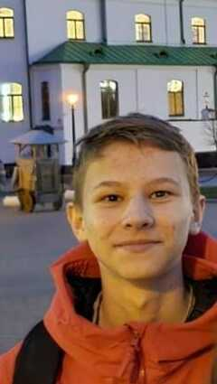

# Stepan Zuikov

## Junior Frontend Developer
### Contact information
* **Phone:** +7 906 697 4021
* **Email:** stedeem@gmail.com
* **Telegram:** [stepan zuikov](https://t.me/StepFluffy)
* **GitHub:** [stedeem](https://github.com/stedeem)
* **CodePen** [Stepan Zuikov](https://codepen.io/nqwkhrsb-the-vuer)

### About me
Hello, my name is Stepan. I am 14 years old. I was born on December 22. I am in 8th grade. I live in the town of Trubchevsk. This small town.
I'm interested in programming. I have been studying programming since I was 13 years old. I'm usually at school, but in my free time I like to to create sites and also I like walk and talk with friends. I have many friends.
In the future I want to become a programmer and live in Switzerland.

### Skills
* **HTML**
* **CSS**
* **JS**
* **Python**
* **C#**
* **Adobe Audition**

### Code example
```
public class Test {// объявляется класс Test
 
                public static void main(String[] args) {// так включаются программы,
                                                       // просто запомнить
              
                   System.out.println("Hello world");
                   System.out.println("5 раз");
                }
            

}
```
### Courses
* **Individual training course**
* **Cours on the platform code-basics**
* **W3School**

### Languages
* **Russian**
* **English**